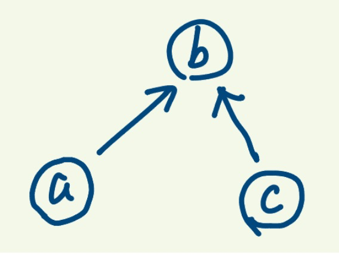

给定一个由表示变量之间关系的字符串方程组成的数组，每个字符串方程 equations[i] 的长度为 4，并采用两种不同的形式之一："a==b" 或 "a!=b"。在这里，a 和 b 是小写字母（不一定不同），表示单字母变量名。

只有当可以将整数分配给变量名，以便满足所有给定的方程时才返回 true，否则返回 false。 

 

示例 1：
```
输入：["a==b","b!=a"]
输出：false
解释：如果我们指定，a = 1 且 b = 1，那么可以满足第一个方程，但无法满足第二个方程。没有办法分配变量同时满足这两个方程。
```
示例 2：
```
输出：["b==a","a==b"]
输入：true
解释：我们可以指定 a = 1 且 b = 1 以满足满足这两个方程。
```
示例 3：
```
输入：["a==b","b==c","a==c"]
输出：true
```
示例 4：
```
输入：["a==b","b!=c","c==a"]
输出：false
```
示例 5：
```
输入：["c==c","b==d","x!=z"]
输出：true
```


提示：

1.  `1<= equations.length <= 500`
2. `equations[i].length == 4`
3. `equations[i][0]` 和 `equations[i][3]` 是小写字母
4. `equations[i][1]` 要么是` '='`，要么是` '!'`
5. `equations[i][2]` 是` '='`


将具有相等关系的变量都放到一起，比如a == b，两者可以放到一个集合里，又因为b==c，所以这个集合里就有了a,b,c三个变量，为了更明确的表示关系，我们使用树形结构来表示a,b,c这样的一类关系，可以得出所有相等的变量都属于同一颗树中。



此时有第三个方程式：a !=c，根据上面的关系，a == b, b == c, a, b, c三者处于同一颗树中，所以不存在不相等关系，因此[a==b, b ==c, a != c]这一组方程式不成立。此时大概可以知道只要不相等的两个变量不存在于同一颗树中就行。

思路就是先遍历所有的等式，构建树，然后遍历不等式，如果不等式两边变量处在同一颗树中则表示给出的方程式不满足。

我们是先将各个元素集合并到了一起，然后在其中查找是否有满足条件的元素，谓之“并查集”。

```go
// 并查集
func equationsPossible(equations []string) bool{
  parent := make([]int, 26); // 构建节点-》父节点映射
  // parent[i]表示i在树形结构上的父节点
  for i := range parent{
    parent[i] = i;
  }

  for _, equation := range equations{ // 构建相等的集合
    if equation[1] == '=' { // 如果是 ==，则合并，合并后有相同根节点
      index1 := int(equation[0] - 'a');
      index2 := int(equation[3] - 'a');
      union(parent, index1, index2)
    }
  }

  for _, equation := range equations{ // 处理不等式，如果不等式两端的变量有相同的根节点则不满足
    if equation[1] == '!'{
      index1 := int(equation[0] - 'a');
      index2 := int(equation[3] - 'a');
      if find(parent, index1) == find(parent, index2){ // 是否有相同根节点
        return false;
      }
    }
  }
  return true;
}

// 合并两个集合a, b：将a节点的根节点的父节点连接到b的根节点上
func union(parent []int, index1, index2 int ) {
  parent[find(parent, index1)] = find(parent, index2);
}

// 查找根节点
// 根节点特征是parent[index]=index
// parent[index] 返回index的父节点
func find(parent []int, index int) int{
  for parent[index] != index {
    parent[index] = parent[parent[index]];
    index = parent[index];
  }

  return index;
}
```

如果父节点是自身，说明这个节点是根节点

一开始所有变量的父节点都是自身

对于每个元素parent[x]指向x在树形结构上的父亲节点。如果x是根节点，则存在parent[x]=x。


为什么要用树：


1. 能明显表示两节点的关系
2. 通过节点就能找到根节点
3. 容易判断两个节点的关系

