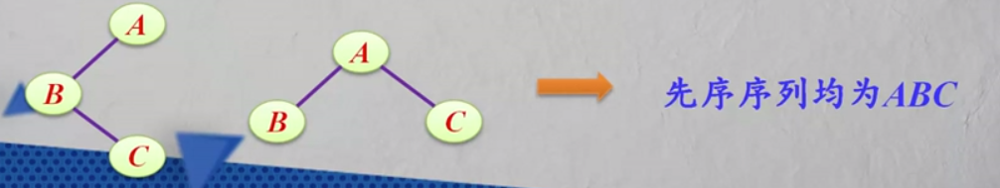
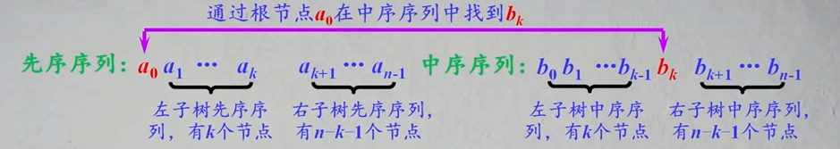
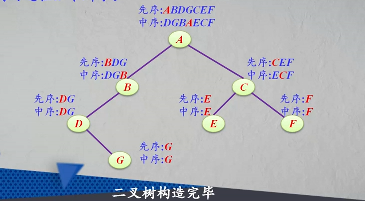
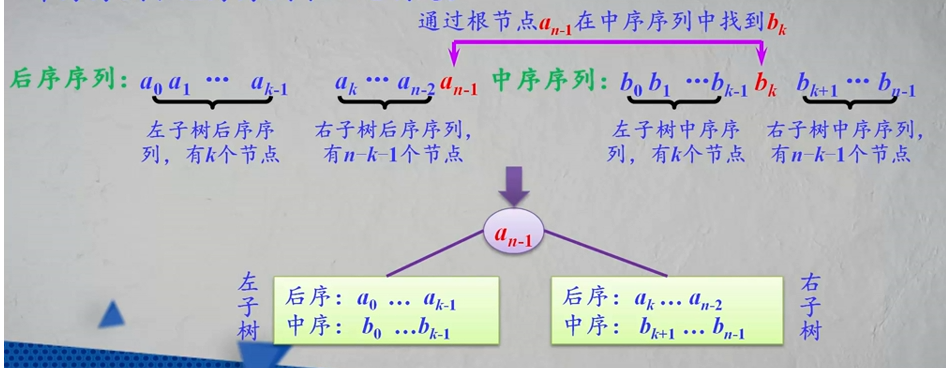
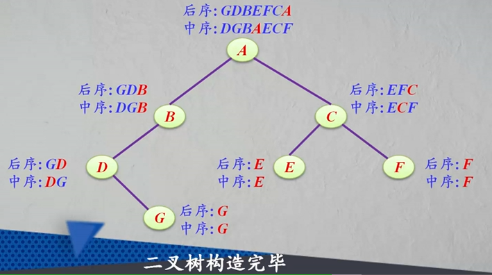

#### 二叉树的构造

同一棵二叉树（假设每个节点值唯一）具有唯一的先序序列、中序序列、和后序序列。

但是，不同的二叉树可能具有相同的先序序列、中序序列或后序序列。

例如：



给定一棵二叉树（假设每个节点值唯一）的先序、中序、和后序序列可以唯一构造（确定）出该二叉树。

仅由先序、中序或后序序列中的一种，无法唯一构造出该二叉树。

同时给定一棵二叉树的先序序列和中序序列就能唯一确定这棵二叉树。

同时给定一棵二叉树的中序序列和后序序列就能唯一确定这棵二叉树。

同时给定一棵二叉树的先序序列和后序序列__不能唯一__确定这棵二叉树。


__定理__：任何n（n>0）个不同节点的二叉树，都可以由它的中序序列和先序序列唯一地确定




例题：已知先序序列为ABDGCEF，中序序列为DGBAECF，则构造二叉树的过程如下所示：




将通过先序序列和中序序列构造二叉树的方法总结成以下代码：

```javascript
function createBinary(firstOrder, inOrder, n){ // n表示节点数量
	if(n <=0){
        return null;
	}
	let rootNode = firstOrder[0]; // 从先序序列中取得根节点
	let k;
	for(let i = 0; i < inOrder.length; i++){ // 去中序序列中寻找根节点位置
        if(inOrder[i] == rootNode){
          	// 在中序序列中k左边的k个节点是左子树的中序序列，k右边的n-k-1个节点是右子树的中序序列
          	// 在先序序列中1~k-1位置的节点为左子树的先序序列，k+1到n-1的节点是右子树的先序序列
          	k = i;
            break
        }
	}
	// 找到了根节点和左右子树的中序及先序序列，接下来就是递归
	// 左子树的先序序列firstOrder[1]~firstOrder[k],中序序列inOrder[0]~inOrder[k-1]
	rootNode.lchild = createBinary(firstOrder.slice(1, k+1), inOrder.slice(0, k), k);
	
	// 右子树的先序序列firstOrder[k+1]~firstOrder[n-1],中序序列inOrder[k+1]~inOrder[n-1];
	rootNode.rchild = createBinary(firstOrder.slice(k+1), inOrder.slice(k+1), n-k-1);
	return rootNode;
}
```


__定理__：任何n个不同节点的二叉树，都可由它的中序序列和后序序列唯一地确定。




例题：已知中序序列为DGBAECF，后序序列为GDBEFCA。对应的构造二叉树的过程如下所示：



对应的程序：

```javascript
function createBinary(postOrder, inOrder, n){
    if(n <=0){
        return null;
    }
    let rootNode = postOrder[n - 1];
    let k;
    for(let i = 0; i < inOrder.length; i++){
        if(inOrder[i] == rootNode){
         	k = i; // 找到根节点在中序序列中的索引位置
            break;
        }
    }
    // 左子树后序序列postOrder[0]~postOrder[k-1],中序序列inOrder[0]~inOrder[k-1]
    rootNode.lchild = createBinary(postOrder.slice(0, k), inOrder.slice(0,k), k);
    
    // 右子树后序序列postOrder[k]~postOrder[n-2],中序序列inOrder[k+1]~inOrder[n-1];
    rootNode.rchild = createBinary(postOrder.slice(k), inOrder.slice(k+1), n-k-1);
    return rootNode;
}

```


例题：设计一个算法，将二叉树的顺序存储结构转换成二叉链存储结构

设二叉树的顺序存储结构为a，由f(a, i)返回创建的二叉链存储结构的根节点指针b，i表示根节点a在顺序存储结构中的位置。顺序存储结构中，a的左子树根节点位置为2i，右子树根节点位置为2i+1。

```javascript
function trans(sA, i){
    if(!sA[i]){
        return null;
    }
    let b = sA[i];
    b.lchild = trans(sA， 2i)；
    b.rchild = trans(sA, 2i +1);
    return b;
}
```


例题：设计一个算法，将二叉树的二叉链存储结构b转换成顺序存储结构a

```javascript
function trans2(b, a, i){ // i表示二叉链中节点在对应的顺序存储结构中的位置
    if(!b){
        return null;
    }
    a[i] = b;
    trans2(b.lchild, a, 2i);
    trans2(b.rchild, a, 2i+1);
}
```


