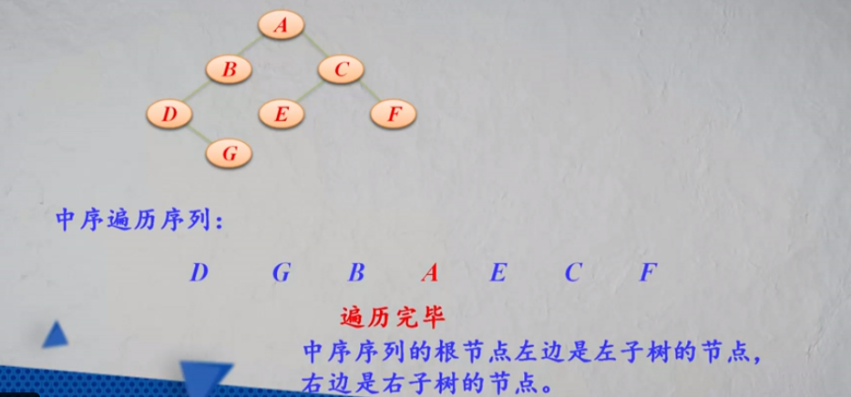
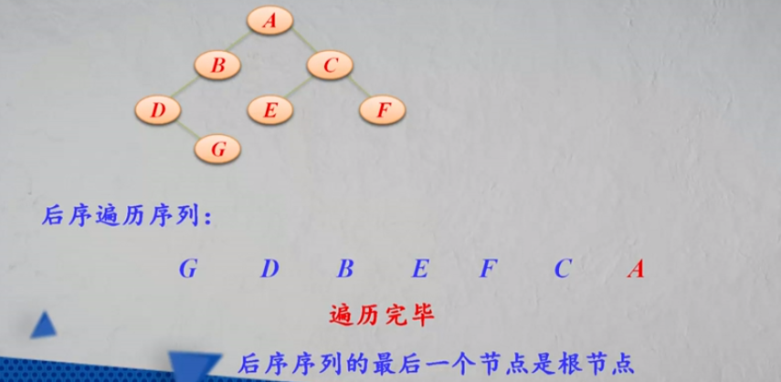
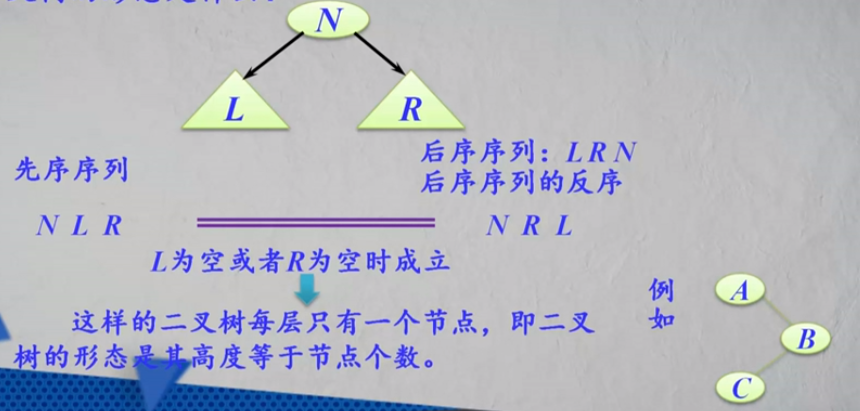

#### 二叉树的遍历

__二叉树的遍历__是指按照一定次序访问树中所有节点，并且每个节点仅被访问一次的过程。

二叉树的组成：根节点N，左子树L，右子树R

6中遍历方式：NLR，LNR，LRN（这三种是L-》R的遍历），NRL，RNL，RLN

1.先序遍历（NLR）：

* 访问根节点
* 先序遍历左子树
* 先序遍历右子树

2.中序遍历（LNR）

* 中序遍历左子树
* 访问根节点
* 中序遍历右子树

中序序列的根节点左边是左子树的节点，右边是右子树的节点

3.后序遍历（LRN）

* 后序遍历左子树
* 后序遍历右子树
* 访问根节点

后序序列中，最后一个节点是根节点

若一棵二叉树的先序序列和后序序列正好相反，该二叉树的形态是什么？

##### 层次遍历过程：

对于一棵二叉树，从根节点开始，按从上到下、从左到右的顺序访问每一个节点。每个节点仅仅被访问一次。

算法设计：使用队列（先进先出）

* 将根节点进队；
* 队不空时循环：从队列中出列一个节点p，访问它：
  * 若它有左孩子节点，则将左孩子节点进队；
  * 若它有有孩子节点，则将右孩子节点进队；

