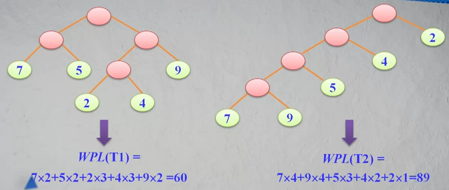

__带权路径长度__：设二叉树具有n个带权值的叶节点，那么从根节点到各个叶节点的路径长度与相应节点权值的乘积的和叫做二叉树的__带权路径长度__（WPL）。

相同的叶节点可以构造出不同的二叉树：

具有最小带权路径长度的二叉树称为__哈夫曼树（也称为最优树）__。

__构造哈夫曼树的原则__：

* 权值越大的叶节点越靠近根节点
* 权值越小的叶节点越远离根节点

__构造哈夫曼树的过程__：

1. 给定的n个权值{W1，W2...，Wn}构造n棵只有叶节点的二叉树，从而得到一个二叉树的集 F = {T1，T2...，Tn}
2. 在F中选取根节点的权值最小和次小的两颗二叉树作为左、右子树构造一棵新的二叉树，这棵新的二叉树根节点的权值为其左、右子树根节点权值之和。
3. 在集合F中删除作为左、右子树的两棵二叉树，并将新建立的二叉树加入到结合F中。
4. 重复2、3两步，当F中只剩下一棵二叉树时，这棵二叉树便是所要建立的哈夫曼树。