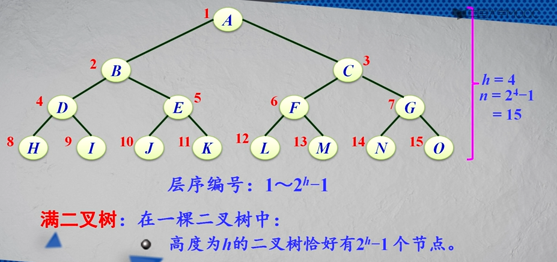

#### 二叉树

##### 二叉树的定义

递归定义：

* 二叉树是有限的节点集合
* 这个集合或者是空
* 或者由一个根节点和两棵互不相交的称为__左子树__和__右子树__的二叉树组成。

二叉树5中基本形态：

* 空树
* 只含根节点
* 右子树为空树
* 左子树为空树
* 左右子树均不为空树

二叉树和2次树有什么区别？

两种特殊结构的二叉树

1.__满二叉树__：在一棵二叉树中

* 如果所有分支节点都有双分支节点；
* 并且叶节点都集中在二叉树的最下一层。

或者可以如下定义：__满二叉树__：在一棵二叉树中，高度为h的二叉树恰好有2^h - 1个节点这样的二叉树称为满二叉树。

2.__完全二叉树__：在一棵二叉树中：

* 最多只有下面两层的节点的度数小于2
* 并且最下面一层的叶节点都依次排列在该层最左边的位置上

__完全二叉树__实际上是对应的__满二叉树__删除叶节点最右边若干个节点得到的。

