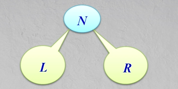
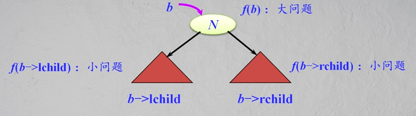
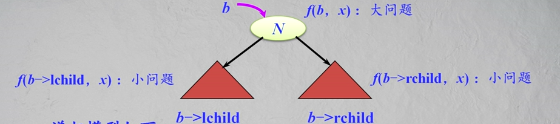
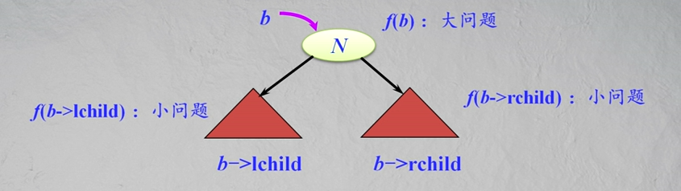

#### 二叉树基本运算

二叉树有以下基本运算：

* __创建二叉树__：根据二叉树括号表示法字符串str生成对应的二叉链存储结构b。
* __销毁二叉链存储结构__：销毁二叉链b，并释放空间。
* __查找节点__：在二叉树b中寻找data域值为x的节点，并返回指向该节点的指针。
* __找孩子节点__：分别求二叉树节点p的左孩子和右孩子。
* __求高度__：求二叉树b的高度。若二叉树为空，则其高度为0；否则，其高度等于左子树与右子树中的最大高度加1。
* __输出二叉树__：以括号表示法输出一棵二叉树。


1.__创建二叉树__

由正确的二叉树括号表示串 =》 二叉链存储结构

正确的二叉树括号表示串中只有4类字符：

* __单个字符__：节点的值
* __(__：左括号，表示一棵左子树的开始
* __)__：右括号，表示一棵子树的结束
* __,__：逗号，表示一棵右子树的开始


算法设计：



* 先构造__根节点N__，再构造__左子树L__，最后构造__右子树R__。
* 构造__右子树R__时，找不到N了，所以需要保存N
* 而节点是按照最近原则匹配的，所以使用一个__栈__保存N。

用ch扫描采用括号表示法表示二叉树的字符串：

1.若ch='('：左括号，则将前面刚创建的节点作为双亲节点进栈，并置k=1，表示开始处理左孩子节点；

2.若ch=')'：右括号，表示栈顶节点的左、右节点处理完毕，退栈；

3.若ch=‘,’：逗号，表示开始处理右孩子节点，置k=2；

4.其他情况：表示节点值

创建p节点用于存放ch：

* 当k=1时，将p节点作为栈顶节点的左孩子节点；
* 当k=2时，将p节点作为栈顶节点的右孩子节点。


2.__销毁二叉链__

设f(b)为销毁二叉链b，可化解为两个小问题：f(b->lchild)销毁左子树，f(b->rchild)销毁右子树

接下来就可以用递归来解决问题。



当 b=null 时，f(b)不做任何事情；

其他情况，f(b) = f(b->lchild) + f(b->rchild) 先释放左子树，再释放右子树

```javascript
void DestroyBT(BTNode *&b){
    if(b == NULL)return;
    else 
    {
        DestroyBT(b->lchild);
        DestroyBT(b->rchild);
    }
}
```


3. __查找节点FindNode(*b, x)__

设f(b, x)为在二叉树b中查找值为x的节点（节点唯一）。找到后返回其指针，否则返回NULL。



递归模型如下：

若b=NULL，直接返回NULL

若b->data == x，即根节点就是要找的节点， 则返回b。

若在左子树中找到了，即p=f(b->lchild, x)且p!=NULL，则返回p的指针

否则就到右子树中查找，f(b, x) = f(b->rchild, x)。

一句话就是，先确定根节点是不是要找的节点，不是就去左子树找，找不到就去右子树找


4.__返回一个节点的左子树和右子树的指针__

5.__求一个二叉树的高度__



求一个二叉树递归模型f(b)如下：

b == NULL, f(b) = 0

其他情况， f(b) = MAX{f(b->lchild), f(b->rchild)} + 1


6.__输出二叉树__

二叉树 =》 二叉树的括号表示

还是用递归解决。

如果根节点b！= null，输出b

如果b有左孩子，且不为null，则输出一个左括号

接着递归处理左孩子

然后如何b有右孩子，且不为null，则输出一个逗号

接着递归处理右孩子

最后输出一个右括号


