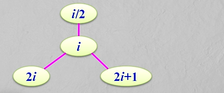
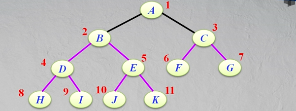
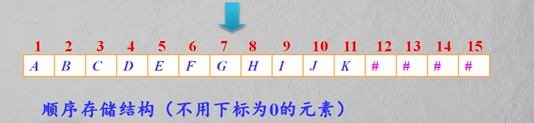
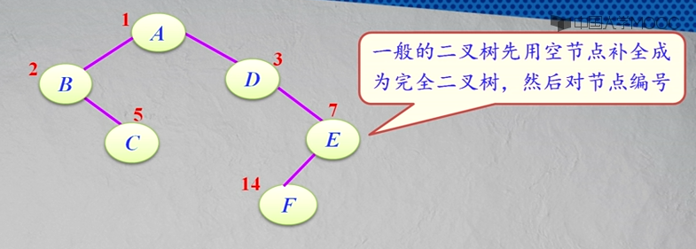
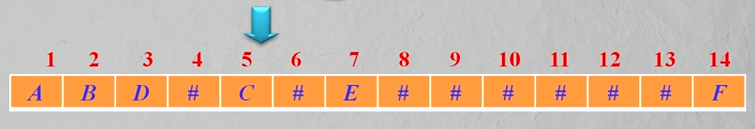
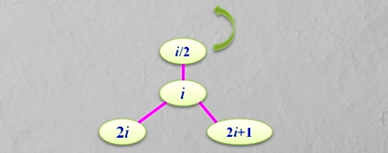
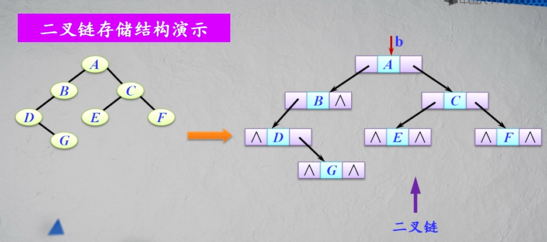

#### 二叉树的存储结构

##### 二叉树的顺序存储结构

完全二叉树按层序编号：

对一棵完全二叉树按照上面的规则编号：

将每个节点按照编号的层序编号存储到对应的下标内。上面这棵完全二叉树对应的存储结构就是下面这个样子：

非完全二叉树如何实现顺序存储结构？

先对非完全二叉树所有空节点补齐成完全二叉树，然后对节点编号。

接下来再将上面的节点映射到一个数组中，空节点用特殊字符来表示，比如#号：

二叉树的顺序存储结构实际上就是一个数组。

二叉树顺序存储结构的特点：

* 对于__完全二叉树__来说，其顺序存储是十分合适的。
* 对于__一般二叉树__，特别是对于那些单分支节点较多的二叉树来说是很不合适的，因为可能只有少数存储单元被利用，特别是对退化的二叉树（即每个分支节点都是单分支的），空间浪费更是惊人。
* 在顺序存储结构中，找一个节点的双亲和孩子都很容易。

##### 二叉树的链式存储结构

二叉树的链式存储结构借鉴的是树的孩子链存储结构来实现的。

二叉链存储结构的特点：

* 除了指针外，二叉链__比较节省存储空间__。占用的存储空间与树形没有关系，只与树中节点个数有关。
* 在二叉链中，__找一个节点的孩子很容易__，但找其双亲不方便。

在二叉链中，空指针个数有多少个？

* n个节点 =》2n个指针域
* 分支数为  n - 1 => 非空指针域有 n - 1个
* 空指针域 = 2n - ( n - 1) = n + 1

