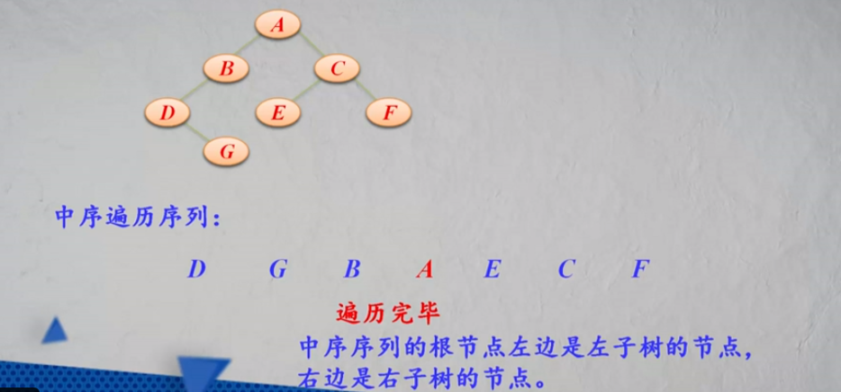
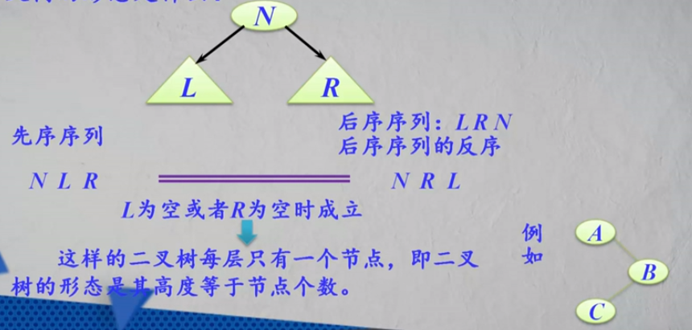

#### 二叉树的遍历

__二叉树的遍历__是指按照一定次序访问树中所有节点，并且每个节点仅被访问一次的过程。

二叉树的组成：根节点N，左子树L，右子树R

6中遍历方式：NLR，LNR，LRN（这三种是L-》R的遍历），NRL，RNL，RLN

1.先序遍历（NLR）：

* 访问根节点
* 先序遍历左子树
* 先序遍历右子树

```javascript
// 先序遍历
function firstOrder(node){
    if(node != null){
        console.log(node);
        firstOrder(node.left); // 递归左子树
        firstOrder(node.right);// 递归右子树
    }
}
```


2.中序遍历（LNR）

* 中序遍历左子树
* 访问根节点
* 中序遍历右子树

```javascript
// 中序遍历
function inOrder(node){
    if(node != null){
        inOrder(node.left);
        console.log(node);
        inOrder(node.right);
    }
}
```


中序序列的根节点左边是左子树的节点，右边是右子树的节点



3.后序遍历（LRN）

* 后序遍历左子树
* 后序遍历右子树
* 访问根节点

```javascript
// 后序遍历
function postOrder(node){
    if(node != null){
        postOrder(node.left);
        postOrder(node.right);
        console.log(node);
    }
}
```


后序序列中，最后一个节点是根节点


若一棵二叉树的先序序列和后序序列正好相反，该二叉树的形态是什么？




##### 层次遍历过程：

对于一棵二叉树，从根节点开始，按从上到下、从左到右的顺序访问每一个节点。每个节点仅仅被访问一次。

算法设计：使用队列（先进先出）

* 将根节点进队；
* 队不空时循环：从队列中出列一个节点p，访问它：
  * 若它有左孩子节点，则将左孩子节点进队；
  * 若它有右孩子节点，则将右孩子节点进队；

```javascript
// 广度优先遍历
function breadthFirst(node){
    let queue = [];
    if(node != null){
        queue.push(node);
        while(queue.length != 0){
            let tempNode = queue.shift();
            console.log(tempNode);
            if(tempNode.left){
                queue.push(tempNode.left);
            }
            if(tempNode.right){
                queue.push(tempNode.right);
            }
        }
    }
}
```


