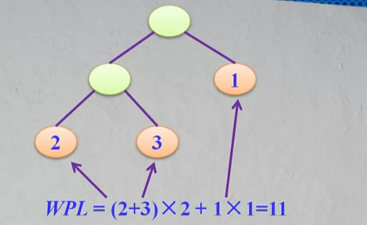
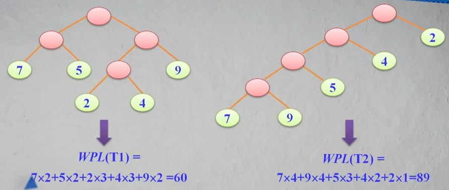
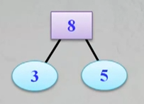
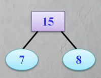
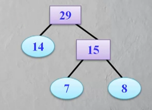
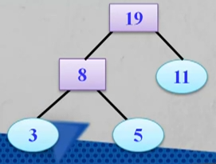
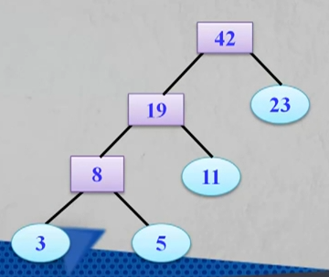
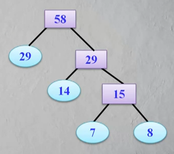
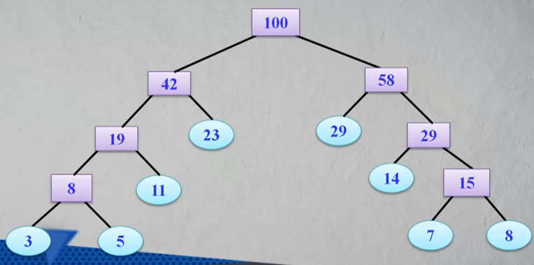

__带权路径长度__：设二叉树具有n个带权值的叶节点，那么从根节点到各个叶节点的路径长度与相应节点权值的乘积的和叫做二叉树的__带权路径长度__（WPL）。

相同的叶节点可以构造出不同的二叉树：

具有最小带权路径长度的二叉树称为__哈夫曼树（也称为最优树）__。

__构造哈夫曼树的原则__：

* 权值越大的叶节点越靠近根节点
* 权值越小的叶节点越远离根节点

__构造哈夫曼树的过程__：

1. 给定的n个权值{W1，W2...，Wn}构造n棵只有叶节点的二叉树，从而得到一个二叉树的集 F = {T1，T2...，Tn}
2. 在F中选取根节点的权值最小和次小的两颗二叉树作为左、右子树构造一棵新的二叉树，这棵新的二叉树根节点的权值为其左、右子树根节点权值之和。
3. 在集合F中删除作为左、右子树的两棵二叉树，并将新建立的二叉树加入到集合F中。
4. 重复2、3两步，当F中只剩下一棵二叉树时，这棵二叉树便是所要建立的哈夫曼树。

__哈夫曼树构造示例__：

给定以下几个叶节点的权值，构造哈夫曼树：{5, 29, 7, 8, 14, 23, 3, 11}。

1.构造只有叶节点的二叉树，得到结合F = {5， 29， 7， 8， 14， 23， 3， 11}；

2.从F中选取权值最小和次小的两棵二叉树作为左、右子树构造一棵新的二叉树：

3.从集合F中删除刚刚用到的左右子树，并将上面这棵新的二叉树放入集合中，这棵新的二叉树权值等于左右子树权值之和

4.此时，集合F={8， 29， 7， 8， 14， 23， 11}，继续挑选最小和次小的构造二叉树：

5.此时，集合F={8, 29, 14, 23, 11, 15}。如此重复下去：

集合F={8, 29, 23, 11, 29}，选择最小和次小：

集合F={29, 23, 19, 29 }，选择最小和次小：

集合F={29, 42, 29}，选择最小和次小：

集合F={42, 58}，选择最小和次小：

哈夫曼树构造完毕。

__哈夫曼树特点__：

* n1 = 0：因为哈夫曼树构造过程中都是节点两个两个结合，所以没有单分支节点；
* 所以就有： n = n0 + n1 + n2 = n0 + n2 = 2n0 - 1

__哈夫曼编码__：

规定哈夫曼树中__左分支为0，右分支为1__，则从根节点到每个叶节点所经过的分支对应的0 和1 组成的序列便成为对应叶子节点的编码，这样的编码称为哈夫曼编码。

__哈夫曼编码特点：__权值越大的字符编码越短，反之越长

__在一组字符的哈夫曼编码中，不可能出现一个字符的哈夫曼编码是另一个字符哈夫曼编码的前缀（哈夫曼编码也称为前缀编码）__。

问题：对n(n>=2)个权值均不同的字符构成哈夫曼树，关于该树的叙述中，错误的是：A

A：该树一定是一棵完全二叉树

B：该树中一定没有度为1的节点

C：树中两个权值最小的节点一定是兄弟节点

D：树中任一非叶子节点的权值一定不小于下一层任一节点的权值

