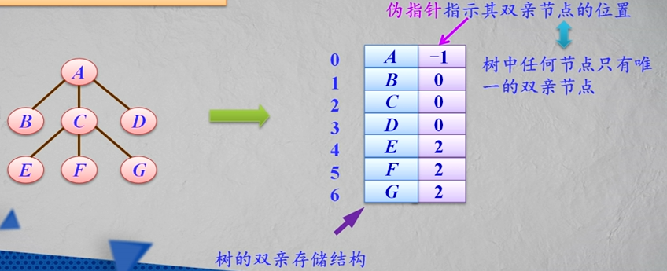
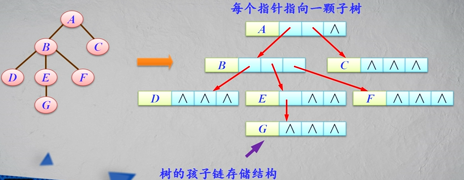
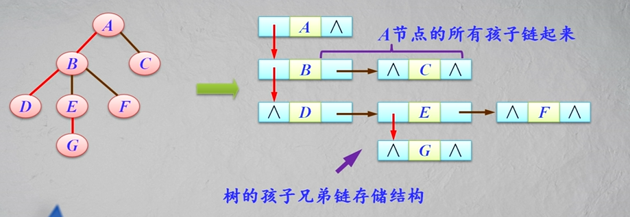
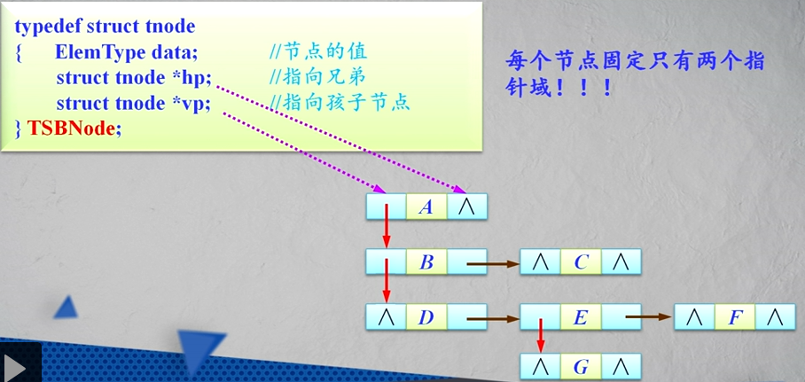

树的运算主要分为三大类：

* __查找__满足某种特定关系的节点，如查找当前节点的双亲节点等；
* __插入或删除__某个节点，如在树的当前节点上插入一个新节点或删除当前节点的第i个孩子节点等；
* __遍历__树中的每个节点


#### 树的遍历

树的遍历运算是指按某种方式访问树中的__每一个节点且每个节点只被访问一次__。

主要遍历方法：

* 先根遍历：若树不空，则先访问根节点，然后依次先根遍历各棵子树。
* 后根遍历：若树不空，则先依次后根遍历各棵子树，然后访问根节点。
* 层次遍历：若树不空，则自上而下、自左至右访问树中每个节点。

__注意__：先根遍历和后根遍历算法都是递归的。

#### 树的存储结构

1.双亲存储结构

树中任何节点只有唯一的双亲节点。

伪指针指示其双亲节点的位置。



双亲存储结构的类型声明如下：

```
typeof struct
{
    ElemType data; // 节点的值
    int parent; // 指向双亲的位置
}PTree[MaxSize];
```

2.孩子链存储结构

每个指针指向一棵子树。



上面这棵树的节点数最大为3，所以每个节点有3个指针。

孩子链存储结构的节点类型声明如下：

```
typeof struct node
{
    ElemType data; // 节点的值
    struct node*sons[MaxSons]; // 指向孩子节点
} TSonNode;
```

其中，MaxSons为最多的孩子节点个数。

思考：

* n个节点的m次树有多少个空指针域？
* 孩子链存储结构的优缺点？

3.孩子兄弟链存储结构

孩子兄弟链存储结构是为每个节点设计3个域：

* 一个数据元素域
* 第一个孩子节点指针域
* 一个兄弟节点指针域



兄弟链存储结构中节点的类型声明如下：

```
typeof struct tnode
{
    ElemType data; // 节点的值
    struct tnode * hp; // 指向兄弟
    struct tnode * vp; // 指向孩子节点
}TSBNode;
```

每个节点固定只有两个指针域。



