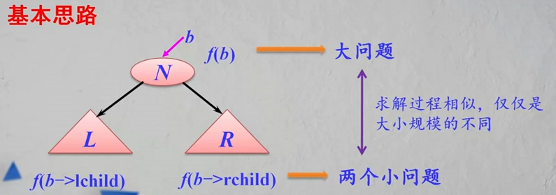

### 树

##### 定义：

树：由n个节点组成的有限集合，其中：

* 如果n=0，它是一个空树，这是树的特例；
* 如果n>0，其中存在一个唯一节点作为树的根节点（root），其余节点可分为m（m > 0）个互不相交的有效子集T1,T2...Tm，而每个子集本身又是一棵树，称为根节点root的子树。


##### 树的基本术语

1.__节点的度与树的度__：树中一个节点的子树的个数称为该__节点的度__。树中各节点的度的最大值称为__树的度__。

2.__分支节点与叶节点__：度不为零的节点称为非终端节点，又叫__分支节点__。度为零的节点称为终端系节点或者__叶节点__，度为1的节点称为__单分支节点__；度为2的节点称为__双分支节点__，以此类推。

3.__路径与路径长度__：两个节点`di`和`dj`的节点序列`(di, di1, di2...dj)`称为__路径__。

__路径长度__等于路径所通过的节点数目减一（即路径上分支数目）

4.__孩子节点、双亲节点和兄弟节点__：在一棵树中，每个节点的后继，被称作该节点的__孩子节点__（或子女节点）。相应地，该节点被称作孩子节点的__双亲节点__（或__父母节点__）。

具有同一双亲的孩子节点互为__兄弟节点__。

5.__子孙节点和祖先节点__：在一颗树中，一个节点的所有子树中的节点称为该节点的__子孙节点__。

从根节点到达一个节点的路径上经过的所有节点被称作该节点的__祖先节点__。

6.__节点的层次和树的高度__：树中的每个节点都处在一个层次上。节点的层次从树根开始定义，根节点为第1层，它的孩子节点为第2层，以此类推，一个节点所在的层次为其双亲节点所在的层次加1.

树中节点的最大层次称为树的__高度__（或树的__深度__）。

7.__有序树和无序树__：若树中各节点的子树是按照一定的次序从左到右安排的，且相对次序是不能随意变换的，则称为__有序树__，否则称为__无序树__。


##### 树的性质

1.树中的节点数等于所有节点的度之和加1：

* 树中每个分支记为一个节点的度=》所有节点的度之和 = 分支数
* 根节点加上一个分支，这样分支数与节点数相同 =》 实际分支数 = n - 1, n为节点数

节点数 n = 度之和 + 1

2.度为m的树中，第i层上至多有m^(i-1)个节点（i>=1）；

3.高度为h的m次树至多有(m^h - 1)/(m - 1)个节点。


#### 二叉树

两种特殊结构的二叉树：

1.__满二叉树__：在一棵二叉树中，

* 如果所有分支节点都有双分支节点
* 并且叶节点都集中在二叉树的最下一层

或者可以如下定义：在一棵二叉树中，高度为 h 的二叉树恰好有2<sup>h-1</sup>个节点，这样的二叉树称为__满二叉树__。

2.__完全二叉树__：在一棵二叉树中：

- 最多只有下面两层的节点的度数小于2
- 并且最下面一层的叶节点都依次排列在该层最左边的位置上

__完全二叉树__实际上是对应的__满二叉树__删除叶节点最右边若干个节点得到的


##### 二叉树的性质

性质1：非空二叉树上叶节点数等于双分支节点数加1。即：n0 = n2 + 1;

性质2：非空二叉树上第i层至多有 2<sup>i-1</sup> 个节点（i>=1）。

性质3：高度为h的二叉树至多有2<sup>h-1</sup>个节点（h>=1）。


##### 二叉树的存储结构

__顺序存储结构__：

* 二叉树的顺序存储结构实际上是一个数组
* 对于完全二叉树来说，其顺序存储结构是十分合适的
* 对于一般二叉树，特别是对于那些单分支节点较多的二叉树来说是很不合适的，以为可能只有少数存储单元被利用，特别是对退化的二叉树（即每个分支节点都是单分支的），空间浪费更是惊人。
* 在顺序存储结构中，找一个节点的双亲和孩子都很容易，节点 i 的双亲为 i/2，左孩子为 2i，右孩子为 2i+1

__二叉链存储结构__：

* 除了指针外，二叉链比较节省存储空间按，占用的存储空间与树形没有关系，只与树中节点个数有关。
* 在二叉链中，找一个节点的孩子很容易，但找其双亲不方便。
* 在二叉链中，空指针个数有多少个？
  * n 个节点 =》 2n 个指针域
  * 分支数位 n - 1 => 非空指针域有 n  - 1个
  * 空指针域有 n + 1 个


##### 二叉树的遍历

__二叉树的遍历__是指按照一定的次序访问树中所有节点，并且每个节点仅被访问一次的过程。

二叉树的组成：根节点N，左子树L，右子树R

1.先序遍历

算法设计：递归

* 访问根节点
* 先序遍历左子树
* 先序遍历右子树

```javascript
// 先序遍历
function firstOrder(node){
    if(node !== null){
        console.log(node);
        firstOrder(node.left);
        firstOrder(node.right);
    }
}
```

__先序遍历第一个节点是根节点__

2.中序遍历（LNR）

算法设计：递归

* 中序遍历左子树
* 访问根节点
* 中序遍历右子树

```javascript
// 中序遍历
function inOrder(node){
    if(node !== null){
        inOrder(node.left);
        console.log(node);
        inOrder(node.right)
    }
}
```

__中序遍历的根节点左边是左子树的节点，右边是右子树的节点__

3.后序遍历

算法设计：递归

* 后序遍历左子树
* 后序遍历右子树
* 访问根节点

```javascript
function postOrder(node){
    if(node !== null){
        postOrder(node.left);
        postOrder(node.right);
        console.log(node);
    }
}
```

__后序遍历的最后一个节点是根节点__

3.层次遍历（广度优先）

层次遍历过程：对于一棵二叉树，从根节点开始，按从上到下、从左到右的顺序访问每一个节点。每个节点仅仅被访问一次。

算法设计：使用队列（先进先出）

* 将根节点进队
* 队不空时循环：从队列中取出一个节点p，访问它：
  * 若它有左孩子，则将左孩子进队；
  * 若它有右孩子，则将右孩子进队。

```javascript
// 广度优先
function breadthFirst(node){
    let queue = [];
    if(node !== null){
        queue.push(node);
        while(queue.length != 0){
            let tempNode = queue.shift();
            console.log(tempNode);
            if(tempNode.left){
                queue.push(tempNode.left);
            }
            if(tempNode.right){
                queue.push(tempNode.right)
            }
        }
    }
}
```


##### 二叉树遍历的应用

二叉树的三种顺序的遍历：先序遍历，中序遍历，后序遍历算法的实现采用的都是递归的思想

递归基本思路：`f(b)`是大问题，`f(b.left)`和`f(b.right)`是小问题，它们求解过程类似，仅仅是大小规模有所不同。



__问题一__：假设二叉树采用二叉链存储结构，设计一个算法，计算一棵给定二叉树的所有节点个数。

算法思路：递归，由`f(b)`大问题转化成`f(b->lchild)`和`f(b->rchild)`小问题

```javascript
function countNodes(node){
    if(!node){
        return 0;
    } else {
    	// 先左子树，后右子树，再根节点，使用的是后序遍历的思想
        return countNodes(node.left) + countNode(node.right) + 1;
    }
}
```

__问题二__：假设二叉树采用二叉链存储结构，设计一个算法，计算一棵给定二叉树的所有叶子节点个数。

算法思路：递归

```javascript
function count(node){
    if(!node){
        return 0; // 如果根节点不存在，返回0
    } else if(!node.left && !node.right) {
        return 1; // 如果根节点就是叶子节点，返回1
    } else {
        return count(node.left) + count(node.right);
    }
}
```

__问题三__：假设二叉树采用二叉链存储结构，设计一个算法输出从根节点到每个叶子节点的逆路径

```javascript
function sNode(node){
	let node;
	let parent;
	let qu = [];
	let front = -1, rear = -1;
	qu[0] = {};
	qu[0].node = node;
	qu[0].parent = -1; // parent存储的是索引值
	rear++;
	
    // 每增加一个节点rear加1，每遍历一个节点front加1
	while(front !== rear){
		front++;
        let q = q[front].node;
        if(!q.left && !q.right){ // 如果是叶子节点，开始打印路径
            let p = front;
            while(qu[p].parent){ // 根据parent属性回溯向上打印双亲节点
                console.log(qu[p].node);
                p = qu[p].parent;
            }
            console.log(qu[p].node); // 输出根节点
        }
        if(q.left){
            rear++;
            qu[rear] = {};
            qu[rear].node = q.left;
            qu[rear].parent = front; // 当前所遍历节点的双亲节点的位置为front
        }
        if(q.right){
            rear++;
            qu[rear] = {};
            qu[rear].node = q.right;
            qu[rear].parent = front;
        }
	}
}
```

