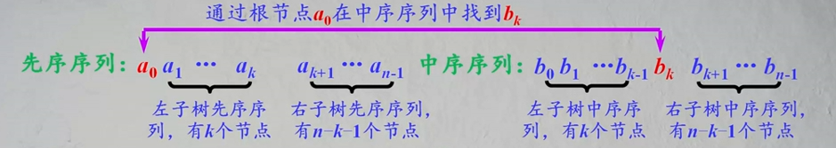
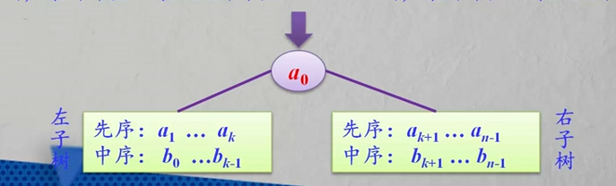

### 树

##### 定义：

树：由n个节点组成的有限集合，其中：

* 如果n=0，它是一个空树，这是树的特例；
* 如果n>0，其中存在一个唯一节点作为树的根节点（root），其余节点可分为m（m > 0）个互不相交的有效子集T1,T2...Tm，而每个子集本身又是一棵树，称为根节点root的子树。


##### 树的基本术语

1.__节点的度与树的度__：树中一个节点的子树的个数称为该__节点的度__。树中各节点的度的最大值称为__树的度__。

2.__分支节点与叶节点__：度不为零的节点称为非终端节点，又叫__分支节点__。度为零的节点称为终端系节点或者__叶节点__，度为1的节点称为__单分支节点__；度为2的节点称为__双分支节点__，以此类推。

3.__路径与路径长度__：两个节点`di`和`dj`的节点序列`(di, di1, di2...dj)`称为__路径__。

__路径长度__等于路径所通过的节点数目减一（即路径上分支数目）

4.__孩子节点、双亲节点和兄弟节点__：在一棵树中，每个节点的后继，被称作该节点的__孩子节点__（或子女节点）。相应地，该节点被称作孩子节点的__双亲节点__（或__父母节点__）。

具有同一双亲的孩子节点互为__兄弟节点__。

5.__子孙节点和祖先节点__：在一颗树中，一个节点的所有子树中的节点称为该节点的__子孙节点__。

从根节点到达一个节点的路径上经过的所有节点被称作该节点的__祖先节点__。

6.__节点的层次和树的高度__：树中的每个节点都处在一个层次上。节点的层次从树根开始定义，根节点为第1层，它的孩子节点为第2层，以此类推，一个节点所在的层次为其双亲节点所在的层次加1.

树中节点的最大层次称为树的__高度__（或树的__深度__）。

7.__有序树和无序树__：若树中各节点的子树是按照一定的次序从左到右安排的，且相对次序是不能随意变换的，则称为__有序树__，否则称为__无序树__。


##### 树的性质

1.树中的节点数等于所有节点的度之和加1：

* 树中每个分支记为一个节点的度=》所有节点的度之和 = 分支数
* 根节点加上一个分支，这样分支数与节点数相同 =》 实际分支数 = n - 1, n为节点数

节点数 n = 度之和 + 1

2.度为m的树中，第i层上至多有m^(i-1)个节点（i>=1）；

3.高度为h的m次树至多有(m^h - 1)/(m - 1)个节点。


#### 二叉树

两种特殊结构的二叉树：

1.__满二叉树__：在一棵二叉树中，

* 如果所有分支节点都有双分支节点
* 并且叶节点都集中在二叉树的最下一层

或者可以如下定义：在一棵二叉树中，高度为 h 的二叉树恰好有2<sup>h-1</sup>个节点，这样的二叉树称为__满二叉树__。

2.__完全二叉树__：在一棵二叉树中：

- 最多只有下面两层的节点的度数小于2
- 并且最下面一层的叶节点都依次排列在该层最左边的位置上

__完全二叉树__实际上是对应的__满二叉树__删除叶节点最右边若干个节点得到的


##### 二叉树的性质

性质1：非空二叉树上叶节点数等于双分支节点数加1。即：n0 = n2 + 1;

性质2：非空二叉树上第i层至多有 2<sup>i-1</sup> 个节点（i>=1）。

性质3：高度为h的二叉树至多有2<sup>h-1</sup>个节点（h>=1）。


##### 二叉树的存储结构

__顺序存储结构__：

* 二叉树的顺序存储结构实际上是一个数组
* 对于完全二叉树来说，其顺序存储结构是十分合适的
* 对于一般二叉树，特别是对于那些单分支节点较多的二叉树来说是很不合适的，以为可能只有少数存储单元被利用，特别是对退化的二叉树（即每个分支节点都是单分支的），空间浪费更是惊人。
* 在顺序存储结构中，找一个节点的双亲和孩子都很容易，节点 i 的双亲为 i/2，左孩子为 2i，右孩子为 2i+1

__二叉链存储结构__：

* 除了指针外，二叉链比较节省存储空间按，占用的存储空间与树形没有关系，只与树中节点个数有关。
* 在二叉链中，找一个节点的孩子很容易，但找其双亲不方便。
* 在二叉链中，空指针个数有多少个？
  * n 个节点 =》 2n 个指针域
  * 分支数位 n - 1 => 非空指针域有 n  - 1个
  * 空指针域有 n + 1 个


##### 二叉树的遍历

__二叉树的遍历__是指按照一定的次序访问树中所有节点，并且每个节点仅被访问一次的过程。

二叉树的组成：根节点N，左子树L，右子树R

1.先序遍历

算法设计：递归

* 访问根节点
* 先序遍历左子树
* 先序遍历右子树

```javascript
// 先序遍历
function firstOrder(node){
    if(node !== null){
        console.log(node);
        firstOrder(node.left);
        firstOrder(node.right);
    }
}
```

__先序遍历第一个节点是根节点__

2.中序遍历（LNR）

算法设计：递归

* 中序遍历左子树
* 访问根节点
* 中序遍历右子树

```javascript
// 中序遍历
function inOrder(node){
    if(node !== null){
        inOrder(node.left);
        console.log(node);
        inOrder(node.right)
    }
}
```

__中序遍历的根节点左边是左子树的节点，右边是右子树的节点__

3.后序遍历

算法设计：递归

* 后序遍历左子树
* 后序遍历右子树
* 访问根节点

```javascript
function postOrder(node){
    if(node !== null){
        postOrder(node.left);
        postOrder(node.right);
        console.log(node);
    }
}
```

__后序遍历的最后一个节点是根节点__

3.层次遍历（广度优先）

层次遍历过程：对于一棵二叉树，从根节点开始，按从上到下、从左到右的顺序访问每一个节点。每个节点仅仅被访问一次。

算法设计：使用队列（先进先出）

* 将根节点进队
* 队不空时循环：从队列中取出一个节点p，访问它：
  * 若它有左孩子，则将左孩子进队；
  * 若它有右孩子，则将右孩子进队。

```javascript
// 广度优先
function breadthFirst(node){
    let queue = [];
    if(node !== null){
        queue.push(node);
        while(queue.length != 0){
            let tempNode = queue.shift();
            console.log(tempNode);
            if(tempNode.left){
                queue.push(tempNode.left);
            }
            if(tempNode.right){
                queue.push(tempNode.right)
            }
        }
    }
}
```


##### 二叉树遍历的应用

二叉树的三种顺序的遍历：先序遍历，中序遍历，后序遍历算法的实现采用的都是递归的思想

递归基本思路：`f(b)`是大问题，`f(b.left)`和`f(b.right)`是小问题，它们求解过程类似，仅仅是大小规模有所不同。


__问题一__：假设二叉树采用二叉链存储结构，设计一个算法，计算一棵给定二叉树的所有节点个数。

算法思路：递归，由`f(b)`大问题转化成`f(b->lchild)`和`f(b->rchild)`小问题

```javascript
function countNodes(node){
    if(!node){
        return 0;
    } else {
    	// 先左子树，后右子树，再根节点，使用的是后序遍历的思想
        return countNodes(node.left) + countNode(node.right) + 1;
    }
}
```

__问题二__：假设二叉树采用二叉链存储结构，设计一个算法，计算一棵给定二叉树的所有叶子节点个数。

算法思路：递归

```javascript
function count(node){
    if(!node){
        return 0; // 如果根节点不存在，返回0
    } else if(!node.left && !node.right) {
        return 1; // 如果根节点就是叶子节点，返回1
    } else {
        return count(node.left) + count(node.right);
    }
}
```

__问题三__：假设二叉树采用二叉链存储结构，设计一个算法输出从根节点到每个叶子节点的逆路径

```javascript
function sNode(node){
	let node;
	let parent;
	let qu = [];
	let front = -1, rear = -1;
	qu[0] = {};
	qu[0].node = node;
	qu[0].parent = -1; // parent存储的是索引值
	rear++;
	
    // 每增加一个节点rear加1，每遍历一个节点front加1
	while(front !== rear){
		front++;
        let q = q[front].node;
        if(!q.left && !q.right){ // 如果是叶子节点，开始打印路径
            let p = front;
            while(qu[p].parent){ // 根据parent属性回溯向上打印双亲节点
                console.log(qu[p].node);
                p = qu[p].parent;
            }
            console.log(qu[p].node); // 输出根节点
        }
        if(q.left){
            rear++;
            qu[rear] = {};
            qu[rear].node = q.left;
            qu[rear].parent = front; // 当前所遍历节点的双亲节点的位置为front
        }
        if(q.right){
            rear++;
            qu[rear] = {};
            qu[rear].node = q.right;
            qu[rear].parent = front;
        }
	}
}
```


##### 二叉树的构造

同一棵二叉树（假设每个节点值唯一）具有唯一的先序序列、中序序列和后序序列。

但是，__不同二叉树可能具有相同的先序序序列、中序序列或后序序列。__

仅由先序、中序或后序序列中的一种，无法唯一构造出该二叉树。

__同时给定一棵二叉树的先序序列和中序序列能唯一确定这棵二叉树。__

__同时给定一棵二叉树的中序序列和后序序列能唯一确定这棵二叉树。__

同时给定一棵二叉树的先序序列和后序序列__不能__唯一确定这棵二叉树。


__定理：__任何n（n>0）个不同节点的二叉树，都可以由它的中序序列和先序序列唯一地确定。





构造过程的代码：

```javascript
function createBinary(firstOrder, inOrder, n){
	if(n <= 0){
        return null;
	}
	let rootNode = firstOrder[0]; // 从先序序列中获取根节点
	let k;
	for(let i = 0; i < inOrder.length; i++){ // 寻找根节点在中序序列中的位置
        if(inOrder[i] == rootNode){
            k = i;
            break;
        }
	}
    // 通过中序序列中根节点的位置k，可以知道左右子树的节点个数
    // 由此也就可以知道左右子树各自的先序和中序序列，然后递归就可以了
	rootNode.left = createBinary(firstOrder.slice(1, k+1), inOrder(0, k), k);
	rootNode.right = createBinary(firstOrder.slice(k+1), inOrder.slice(k+1), n-k-1);
	return rootNode
}
```

__定理：__任何n（n>0）个不同节点的二叉树，都可由它的中序序列和后序序列唯一地确定。

构造过程和上面差不多，由后序序列可以获取根节点，接下来寻找根节点在中序序列中的位置，再接下来就知道左右子树的中序序列和后序序列，所以还是个递归。

```javascript
function createBinary(postOrder, inOrder, n){
    if(n <= 0){
        return null;
    }
    let rootNode = postOrder[n - 1]; // 找到根节点
    let k;
    for(let i = 0; i < inOrder.length; i++){
        if(inOrder(i) == rootNode){ // 寻找根节点在中序序列中的位置
            k = i;
            break;
        }
    }
    
    // 使用左右子树的中序序列和后序序列递归调用createBinary
    rootNode.left = createBinary(postOrder.slice(0, k), inOrder(0, k), k);
    rootNode.right = createBinary(inOrder.slice(k, n-1), inOrder(k+1), n-k-1);
    return rootNode;
}
```


__例题：__设计一个算法，将二叉树的顺序存储结构转换成二叉链存储结构

设二叉树的顺序存储结构为a，由f(a, i)返回创建的二叉链存储结构的根节点指针b，其中 i 表示根节点在顺序存储结构中的位置。__顺序存储结构中，根节点的左子树根节点为 2i， 右子树根节点为 2i+1。__

```javascript
function trans(s, i){
    if(!s[i]){
        return null;
    }
    let b = s[i];
    b.left = trans(s, 2i);
    b.right = trans(s, 2i+1);
    return b;
}
```

__例题：__设计一个算法，将二叉树的二叉链存储结构 b 转换成顺序存储结构

```javascript
function trans(b, a, i){ // i 表示二叉链中节点在顺序存储结构中对应的位置
    if(!b){
        return null;
    }
    a[i] = b;
    trans(b.left, a, 2i);
    trans(b.right, a, 2i + 1);
}
```


#### 线索二叉树

对于具有 n 个节点的二叉树来说，采用二叉链存储结构时，每个节点有两个指针域，总共有 2n 个指针域。

其中有 n + 1 个空指针域。

将这 n+1 个空指针域用来存放线索，来提高遍历的效率。

修改空指针域为存放指向节点的前趋和后继节点的地址，这种指向线性序列中的前趋和后继的指针，称为__线索__。

创建线索二叉树的过程称为__线索化__。

线索二叉树与采用的遍历方法相关，有__先序线索二叉树、中序线索二叉树和后序线索二叉树。__

线索二叉树的目的就是__提高该种二叉树的遍历效率__。


##### 如何设计线索二叉树

记 p 指向二叉链表中的一个节点，以中序遍历为例，以下是建立线索二叉树的规则：

* 如果 p.left 为空，则存放指向中序遍历中该节点的前趋节点；
* 如果 p.right 为空，则存放指向中序遍历中该节点的后继节点；

在节点的存储结构上增加两个标识位来区分是存储孩子节点还是前趋或后继节点：

* 0 表示指向孩子节点
* 1 表示指向前趋或后继节点

为了构建方便，为增加一个头结点。


##### 线索化二叉树

建立某种次序的线索二叉树的过程：

* 以该遍历方法遍历一棵二叉树
* 在遍历的过程中，检查当前访问节点的左、右指针域是否为空：
  * 如果左指针域为空，将它改为指向前趋节点的线索
  * 如果右指针域为空，将它改为指向后继节点的线索

以中序遍历为例，建立线索二叉树，以下代码中：

- p总是指向当前线索化的节点；
- pre作为全局变量，指向刚刚访问过的节点；
- pre是p的中序前趋节点，p是pre的中序后继节点。 

```javascript
// rootNode为头节点
function createBinary(b){
    rootNode.ltag = 0;
    rootNode.rtag = 1;
    rootNode.rchild = b;
    if(!b){
       rootNode.lchild = rootNode; 
    } else {
        rootNode.lchild = b;
        pre = rootNode;
        Thread(b, pre);
        pre.rchild = rootNode;
        pre.rtag = 1;
        rootNode.rchild = pre;
    }
}

function Thread(node){
    if(node){
        Thread(node.lchild);
        if(!node.lchild){
            node.lchild = pre;
            node.ltag = 1
        } else {
            node.ltag = 0;
        }
        if(!pre.rchild){
            pre.rchild = node;
            pre.rtag = 1;
        } else {
            pre.rtag = 0;
        }
        Thread(node.rchild);
    }
}
```


##### 遍历线索二叉树

遍历某种次序的二叉树，就是从该次序下的开始节点出发，反复找到该节点在该次序下的后续节点，直到头结点。

以中序线索二叉树为例，开始节点是根节点的最左下节点。

```javascript
function thInorder(node， rootNode){ // node为根节点，rootNode为头结点
    while(node != rootNode){
        while(node.ltag == 1){ // 一直往左找，找开始节点
            node = node.ltag;
        }
        console.log(node);
        // 找到开始节点后，接下来就是往后遍历了，也就是会用到rtag
        while(node.rtag == 1 && node.rchild !== rootNode){ // 如果没有左孩子且不指向头节点
            node = node.rchild;
            console.log(node);
        }
        node = node.rchild;
    }
}
```

中序线索二叉树的遍历，没有递归，也没有用栈，空间效率得到提高。

线索二叉树充分利用了指针空间，同时又便于寻找节点的前趋和后继节点。

线索二叉树适用于经常需要遍历寻找节点前趋或者后继节点的二叉树。


#### 哈夫曼树

__带权路径长度__：设二叉树具有 n 个带权值的叶节点，那么从根节点到各个叶节点的路径长度与相应节点权值的乘积的和叫做二叉树的__带权路径长度（WPL）__。

相同的叶节点可以构造出不同的二叉树，具有最小带权路径长度的二叉树称为__哈夫曼树（也称为最优树）__。


__构造哈夫曼树的原则__：

* 权值越大的叶节点越靠近根节点
* 权值越小的叶节点越远离根节点


__构造哈夫曼树的过程__：

1. 给定的n个权值{W<sub>1</sub>，W<sub>2</sub>...，W<sub>n</sub>}构造n棵只有叶节点的二叉树，从而得到一个二叉树的集 F = {T<sub>1</sub>，T<sub>2</sub>...，T<sub>n</sub>}
2. 在F中选取根节点的权值最小和次小的两颗二叉树作为左、右子树构造一棵新的二叉树，这棵新的二叉树根节点的权值为其左、右子树根节点权值之和。
3. 在集合F中删除作为左、右子树的两棵二叉树，并将新建立的二叉树加入到集合F中。
4. 重复2、3两步，当F中只剩下一棵二叉树时，这棵二叉树便是所要建立的哈夫曼树。


__哈夫曼树特点__：

- n<sub>1</sub> = 0：因为哈夫曼树构造过程中都是节点两个两个结合，所以没有单分支节点；
- 所以就有： n = n<sub>0</sub> + n<sub>1</sub> + n<sub>2</sub> = n<sub>0</sub> + n<sub>2</sub> = 2n<sub>0 </sub>- 1


__哈夫曼编码__：

规定哈夫曼树中__左分支为0，右分支为1__，则从根节点到每个叶节点所经过的分支对应的0 和1 组成的序列便成为对应叶子节点的编码，这样的编码称为哈夫曼编码。

__哈夫曼编码特点：__权值越大的字符编码越短，反之越长

__在一组字符的哈夫曼编码中，不可能出现一个字符的哈夫曼编码是另一个字符哈夫曼编码的前缀（哈夫曼编码也称为前缀编码）__。