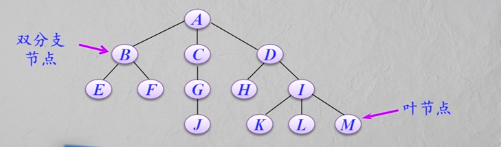
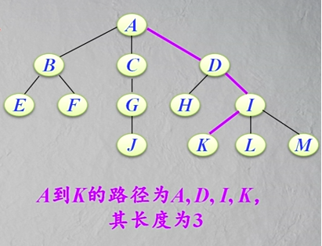
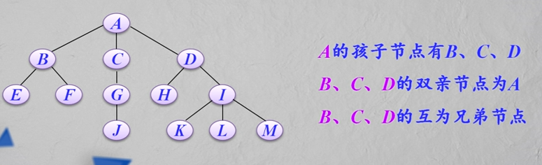
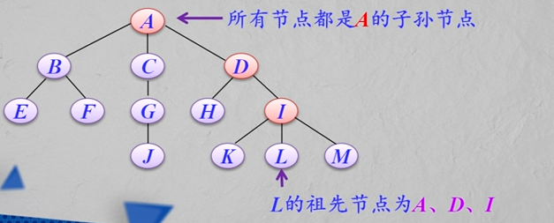
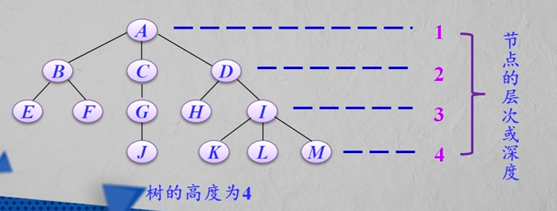
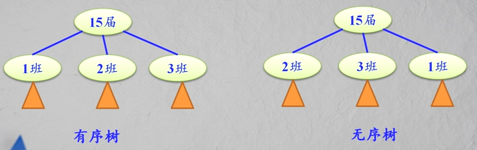

树的递归定义：树是由`n(n>=0)`个节点组成的有限集合（记为T）。其中：

* 如果`n=0`，它是一个空树，这是树的特例
* 如果`n>0`，其中存在一个唯一节点作为树的根节点（root），其余节点可分为`m(m>=0)`个互不相交的有限子集`T1`、`T2`，...`Tm`，而每个子集本身又是一颗树，称为根节点root的子树。

#### 树的基本术语：

1.__节点的度与树的度__：树中一个节点的子树的个数称为该__节点的度__。树中各节点的度的最大值称为__树的度__，通常将度为`m`的树称为__m次树__或者__m叉树__。

2.__分支节点与叶节点__：度不为零的节点称为非终端节点，又叫__分支节点__。度为零的节点称为终端节点或者__叶节点__（或__叶子节点__）。

度为1的节点称为__单分支节点__；度为2的节点称为__双分支节点__，以此类推。

3.__路径与路径长度__：两个节点`di`和`dj`的节点序列`(di, di1, di2...dj)`称为__路径__。

__路径长度__等于路径所通过的节点数目减一（即路径上分支数目）

4.__孩子节点、双亲节点和兄弟节点__：在一棵树中，每个节点的后继，被称作该节点的__孩子节点__（或子女节点）。相应地，该节点被称作孩子节点的__双亲节点__（或__父母节点__）。

具有同一双亲的孩子节点互为__兄弟节点__。

5.__子孙节点和祖先节点__：在一颗树中，一个节点的所有子树中的节点称为该节点的__子孙节点__。

从根节点到达一个节点的路径上经过的所有节点被称作该节点的__祖先节点__。

6.__节点的层次和树的高度__：树中的每个节点都处在一个层次上。节点的层次从树根开始定义，根节点为第1层，它的孩子节点为第2层，以此类推，一个节点所在的层次为其双亲节点所在的层次加1.

树中节点的最大层次称为树的__高度__（或树的__深度__）。

7.__有序树和无序树__：若树中各节点的子树是按照一定的次序从左到右安排的，且相对次序是不能随意变换的，则称为__有序树__，否则称为__无序树__。

8.__森林__：n(n>0)个互不相交的树的集合称为__森林__。

只要把树的根节点删去就成了森林。

反之，只要给n棵独立的树加上一个节点，并把这n棵树作为该节点的子树，则森林就变成了一棵树。

__独木也成林__，一棵树可以看成是森林的特殊情况。

