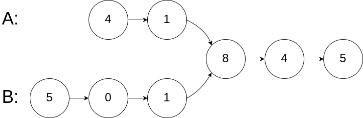

#### 找到两个单链表相交的起始节点

编写一个程序，找到两个单链表相交的起始节点。

如下面的两个链表**：**


在节点 c1 开始相交。

**示例 1：**



```
输入：intersectVal = 8, listA = [4,1,8,4,5], listB = [5,0,1,8,4,5], skipA = 2, skipB = 3
输出：Reference of the node with value = 8
输入解释：相交节点的值为 8 （注意，如果两个列表相交则不能为 0）。从各自的表头开始算起，链表 A 为 [4,1,8,4,5]，链表 B 为 [5,0,1,8,4,5]。在 A 中，相交节点前有 2 个节点；在 B 中，相交节点前有 3 个节点。
```

**示例 3：**


```
输入：intersectVal = 0, listA = [2,6,4], listB = [1,5], skipA = 3, skipB = 2
输出：null
输入解释：从各自的表头开始算起，链表 A 为 [2,6,4]，链表 B 为 [1,5]。由于这两个链表不相交，所以 intersectVal 必须为 0，而 skipA 和 skipB 可以是任意值。
解释：这两个链表不相交，因此返回 null。
```


```java
/**
 * Definition for singly-linked list.
 * public class ListNode {
 *     int val;
 *     ListNode next;
 *     ListNode(int x) {
 *         val = x;
 *         next = null;
 *     }
 * }
 */
// 解法一：双指针，
// A,B两指针分别指向两链表headA/headB头结点，然后让两者逐个向后遍历
// 当A到达尾部时，将其重定向到headB，并继续遍历；同理，当B到达尾部时，将其重定向到headA，并继续遍历
// 若A和B在某一处相遇，则相遇点即为两链表的交点
// 原理就是：a + all + b = b + all + a
public class Solution{
    public ListNode getIntersectionNode(ListNode headA, ListNode headB){
        if(headA == null || headB == null){
            return null
        }
        ListNode A = headA;
        ListNode B = headB;
        while(A != B){ // 如果没有相交节点，A、B最终都会为null，然后循环终止，返回null
            if(A == null){
                A = headB;
            } else {
                A = A.next;
            }
            if(B == null){
                B = headA;
            } else {
                B = B.next;
            }
        }
        return A;
    }
}

// 解法二：暴力解法。对链表A中每一个节点a，遍历整个链表B并检查链表B中是否存在相同节点

// 解法三：哈希表法。遍历链表A并将每个节点的地址/引用存储在哈希表中。然后检查链表B中的每一个节点b是否存在哈希表中。若在，则b为相交节点。
```
