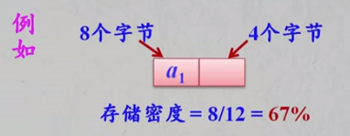

#### 链表

线性表中每个节点有唯一的前趋节点和后继节点

设计链式存储结构时，每个逻辑节点单独存储，为了表示逻辑关系，增加__指针域__。

* 每个物理节点增加一个指向后继节点的指针域，这样的链表称为__单链表__；
* 每个物理节点增加一个指向后继节点和指针域和一个指向前趋节点的指针域，这样的链表称为__双链表__

__存储密度__：指节点__数据本身__所占的存储量和整个节点结构中所占的存储量之比

存储密度 = 节点数据本身占用的空间/节点占用的空间总量



一般地，存储密度越大，存储空间的利用率就越高。显然，顺序表的存储密度为1，而链表的存储密度小于1。


__单链表排序__

```javascript
function sort(L){
	let p = L.next.next; // p指向第二个数据节点
	L.next.next = null; // 构造出一个只含有一个数据节点的有序单链表
	
	while(p !== null){
		let q = p.next;
		let pre = L;
		while(pre.next !== null && pre.next.data < p.data){ // 如果节点值小于p，则继续下个节点
			pre = pre.next;
		}
		
		// 如果节点值大于p，则将p放到该节点前面
		p.next = pre.next;
		pre.next = p;
		p = q;
	}
}
```


__单链表逆转__

```javascript
// 头插法
function reverse(L){
	let p = L.next;
	let q = p.next;
	L.next = null;
	while(p.next !== null){
		p.next = L.next;
		L.next = p;
		p = q;
	}
}
```


